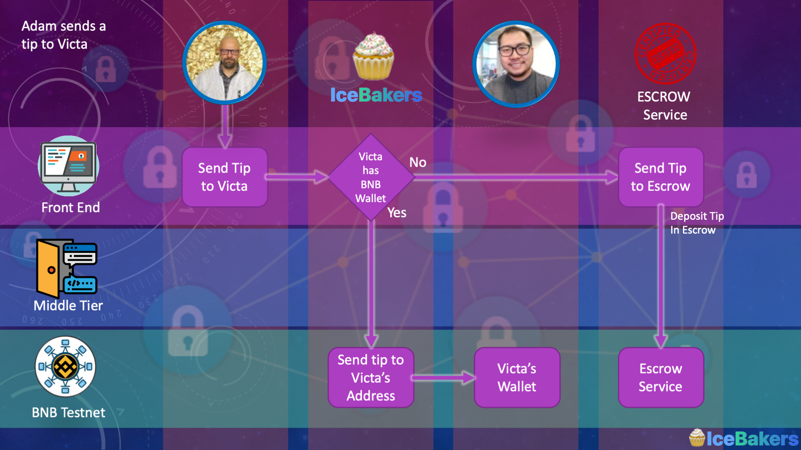
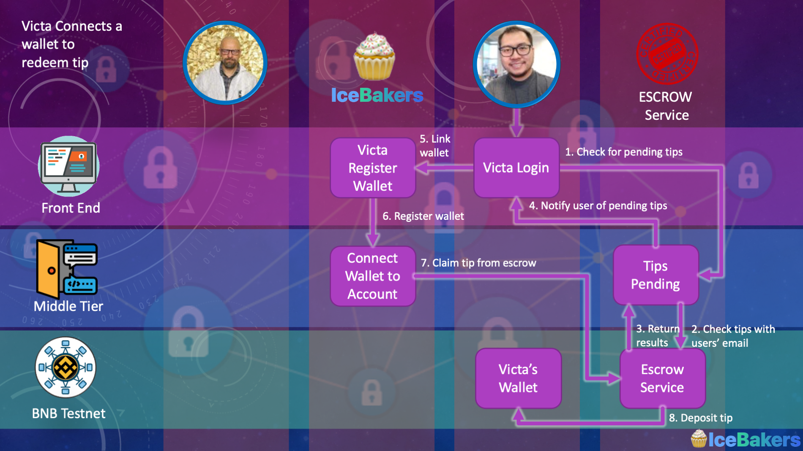

# About [Icebaker](https://icebakers.vercel.app)
We built this quiz game as a tool to know your friends or colleagues better. It is an icebreaker quiz game where you respond to the questions and later you play guess game: whose answer is what you see on the screen. Main differentiator and the reason why we built this with Victa is that you can sent small tip in cryptocurrency for a great answer. 
If you are interested in the technology behind, look at the source and watch the video [here](https://youtu.be/icSKd9gL108).
Do not forget to try our app at https://icebakers.vercel.app

Have fun, 
Adam + Victa

## Smart Contract and Escrow Services
The Escrow Service can be found at the address [0x645dd2b7ea688a29aaafc0bc17d532fa921b57d4](https://testnet.bscscan.com/address/0x645dd2b7ea688a29aaafc0bc17d532fa921b57d4). It is a simple service that allows our users' to tip another user who doesn't already have an account registered with [__IceBakers__](https://icebakers.vercel.app). This is a key piece of functionality to give users a more friendly experience as well as lowers the barrier of entry into the platform. While it is not necessary to have a BNB account with crypto assets to begin using the platform, it is encouraged.  

Tips are stored against a users' Sha256 HASH of their email address, and when the registered user logs in the system will check if they have pending tips (if they have not registered their account), and notify them if they do (encouraging them to connect their wallet to claim the tip). Only the account configured in the __.env.local__ file has permission to receive escrow and release the escrow funds.   

The interaction flow is as follows:  
## Deposit into Escrow ##
  

## Redeem Escrow ##

  

If a user tips a person that has a registered BNB address they will directly send the tip to the user instead of using the escrow.  

## Future Enhancements
@Adam, please write some stuff from an experience perspective

# Building the project from source
## Technologies used
We make use of the following key technologies to build our platform. 
- NextJS + ReactJS : the front-end, middle-tiers and API layers
- GraphQL : the headless layer for managing questions/answers/people/companies
- MongoDB : the backend database to hold our registered users
- Web3JS + Metamask : the connection to the blockchain
- Truffle/Ganache : the development tools to work with the blockchain
- Solidity : the programming language of the decentralised web

Just wanted to give a shout-out to [nextjs](https://nextjs.org/), [vercel.app](https://vercel.com/), [graphcms](https://graphcms.com/) and [mongo atlas](https://www.mongodb.com/cloud) for the great (and free) infrastructure that we are using to host.

## Configuring Environment Variables
Inside __.env.local__ populate the following  
- BINANCE_ENDPOINT=https://data-seed-prebsc-2-s1.binance.org:8545/
- BINANCE_SECRET_KEY : this is your private key containing a funded binance wallet for interacting with the smart contract
- GRAPHCMS_ENDPOINT : this is your GRAPHCMS endpoint
- GRAPHCMS_MUTATION_TOKEN : this is your GRAPHCMS mutation token (Permanent Access Token)
- NEXTAUTH_DATABASE_URL : this is your mongo-db URL (with username and password)
- NEXTAUTH_GOOGLE_ID : this is your google id for OAUTH
- NEXTAUTH_GOOGLE_SECRET : this is your google secret for OAUTH
- NEXTAUTH_URL=http://localhost:3000
- NEXTAUTH_DATABASE : the database to connect to (default to icebakers)

Inside __.secret__ store the same BINANCE_SECRET_KEY as above. This .secret file is used to compile and deploy your Smart Contracts

## Startup
To begin, run the following commands (version 14+ of NodeJS):
- npm install
- npm install --g truffle@5.1.65
- truffle compile
- truffle migrate --network binance --reset
- npm run link-contracts
- npm run dev

# Notes
## connectWallet.js and Mongodb
- When deployed to Vercel.app we need to change connectWallet.js to use the userUsers collection in mongodb.  
- When deployed locally we need to change connectWallet.js to use the users collection in mongodb. Just a weird issue we couldn't solve ...  

## Binance Endpoints
Every now and then the endpoint will fail ... when this happens switch to the available list of endpoints:  
https://data-seed-prebsc-1-s1.binance.org:8545/  
https://data-seed-prebsc-2-s1.binance.org:8545/  
https://data-seed-prebsc-1-s2.binance.org:8545/  
https://data-seed-prebsc-2-s2.binance.org:8545/  
https://data-seed-prebsc-1-s3.binance.org:8545/  
https://data-seed-prebsc-2-s3.binance.org:8545/  

## Accounts and Secrets
- ake sure to fund the secret key with the necessary BNB tokens on the test - etwork. For Metamask, configure to use the endpoints above  
- Make sure to set your network id to 97 in Metamask  

